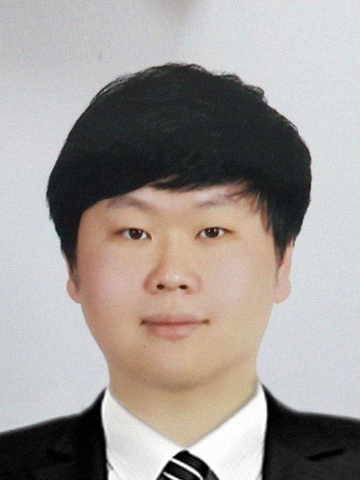

<!--
This is comment
-->

<!--
Always check singular or plural according to the number of people
-->

### Professor

{: style="float: left; width: 150px; padding-right: 30px;"}

#### Seung-wook Kim (seungwook.kim<i>at </i>hufs<i>dot </i>ac<i>dot </i>kr) 
* Assistatnt Professor, Division of Computer Engineering at HUFS
 * Postdoctoral Researcher, Korea University, Mar. 2021 ~ Feb. 2024
 * Ph.D. Eng. in Computer Science and Engineering, Korea University, Feb. 2021
 * BS, Eng. in Computer Science and Engineering, Korea University, Feb. 2016

